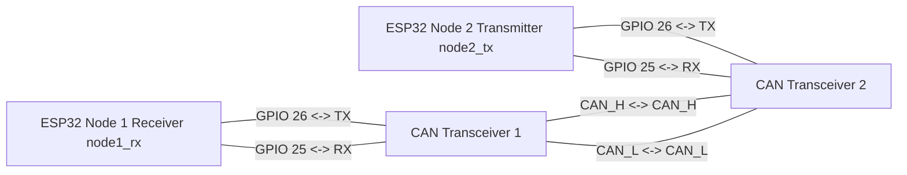

Projekt składa się z 2 modułów ESP32. Tak jak planowałem w pierwszym zadaniu, postanowiłem nie przebudowywać fizycznego stanowiska, dlatego architektura z dwiema płytkami świetnie sprawdziła się również w tym zadaniu. Po prostu ponownie wykorzystaliśmy podstawowe ustawienia sterownika TWAI.

Schemat połączeń modułów:

Tak to wyglądało na żywo :)

## node1_rx
Ten moduł działa jako główny komputer pokładowy, który filtruje ruch przychodzący w czasie rzeczywistym.

### Obsługa CAN i Crisis Mode
Nasłuchuje magistralę CAN i podejmuje błyskawiczne decyzje o priorytecie pakietów.
W trybie normalnym odbiornik odczytuje i wypisuje w terminalu wszystkie dane: GPS, status systemu, temperaturę oraz ciśnienie.
Jednak gdy tylko nadejdzie pakiet z awaryjnym ID (0x001), odbiornik ustawia flagę alarmową (Crisis Mode). W tym stanie zaczyna on programowo ignorować (odrzucać) drugorzędne komunikaty, takie jak GPS i System Status. Zostało to zrobione po to, aby nie tracić czasu procesora na rozpakowywanie niekrytycznych danych (na przykład nie wykonywać cykli dla 8 bajtów współrzędnych), podczas gdy silnik się przegrzewa.

## node2_tx
Wykonuje dwa główne zadania:

1) Ciągłe generowanie gęstego ruchu CAN (test stresowy magistrali).
2) Symulacja pracy silnika i nawigacji.

### Symulacja i generacja danych
W pętli (50 razy na sekundę) stale aktualizowane są parametry: rakieta leci (zmienia się szerokość geograficzna GPS, startujemy z Wrocławia), a silnik się nagrzewa. Ciśnienie w komorze spalania jest obliczane dynamicznie na podstawie aktualnej temperatury.
Aby spełnić wymagania dotyczące różnych rozmiarów ładunku użytecznego (DLC) i priorytetów, zaimplementowałem 4 typy wiadomości:

* **System Status:** ID 0x100 (najniższy priorytet), rozmiar 1 bajt. Tło bicia serca systemu.
* **GPS:** ID 0x050 (średni priorytet), rozmiar 8 bajtów. Zajmuje maksymalną długość ramki CAN.
* **Engine Pressure:** ID 0x020 (wysoki priorytet), rozmiar 4 bajty.
* **Engine Temp:** Dynamiczne ID, rozmiar 4 bajty.

### Realizacja części "Dla ambitnych" (Zmiana priorytetów)
Aby zasymulować zmianę priorytetów w czasie, wykorzystałem sprzętową cechę arbitrażu magistrali CAN. W trybie normalnym temperatura jest wysyłana z ID 0x010. Jednak gdy tylko nastąpi przegrzanie (> 100 stopni), nadajnik "w locie" podmienia ID na 0x001. Ponieważ w magistrali CAN logiczne "0" sprzętowo dominuje nad "1" na przewodach, pakiet z niższym ID uzyskuje absolutny priorytet i fizycznie wyprzedza wszelkie pakiety GPS czy ciśnienia.
